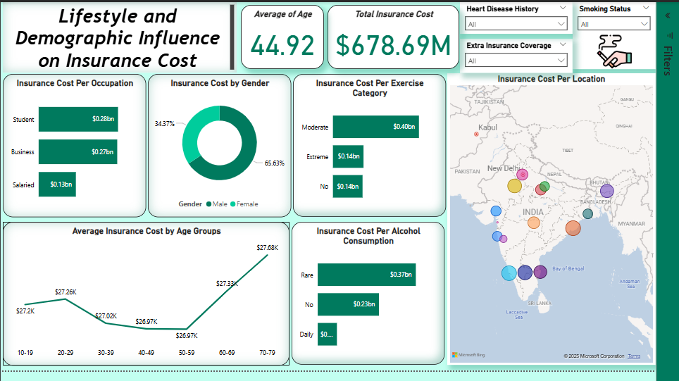

# Policy Pulse: A Power BI Deep Dive into Insurance Cost Factors

This repository contains a comprehensive analysis of an insurance dataset, examining the various factors that influence insurance costs. The dataset includes information on applicant demographics, health indicators, lifestyle choices, and engagement with healthcare services. The insights derived from this analysis can help refine pricing models, identify key risk factors, and develop targeted strategies for customer engagement and product development.

## Objectives Visualized

- **Health Factors & Insurance Costs:**  
  Examines the relationship between cholesterol levels, heart disease history, smoking status, and average insurance costs.

- **Lifestyle & Demographic Influence:**  
  Explores how factors like occupation, age, gender, exercise habits, alcohol consumption, and location correlate with insurance expenses.

- **Customer Engagement & Tenure:**  
  Investigates the link between regular check-ups, doctor visits, years of insurance with the company, and associated insurance costs.

---

## 1. Health Factors & Insurance Costs Report

This section focuses on how various health metrics directly influence insurance costs, helping to identify key risk factors.

**Visual Representation:**  

### Visuals

- **Average Insurance Cost per Cholesterol Level** (Bar Chart)
- **Cholesterol Level Categories** (Pie Chart)
- **Major Disease History by Gender and Smoking Status** (Treemap)
- **Avg Insurance Cost Per Smoking Status & Heart Disease** (Bar Chart)
- **Average Daily Steps** (Gauge)

**Key Insights:**

- The "Average Insurance Cost per Cholesterol Level" chart shows the "200 to 225" mg/dL range with the highest average cost, followed by "125 to 150" and "150 to 175". The "225 to 250" category is anomalously lowest.
- "Cholesterol Level Categories" pie chart: 79.93% "Lower Risk", 11.85% "Moderate Risk", 8.22% "Higher Risk".
- Higher insurance costs are observed among those with heart disease history, with smoking status further differentiating costs.
- Average daily steps: 5.22K, indicating moderate applicant activity.

---

## 2. Lifestyle and Demographic Influence on Insurance Cost Report

This section explores how an applicant’s lifestyle and demographic information correlate with insurance costs, providing insights for customer segmentation.

**Visual Representation:**  

### Visuals

- **Insurance Cost per Occupation** (Bar Chart)
- **Insurance Cost by Gender** (Donut Chart)
- **Insurance Cost per Exercise Category** (Bar Chart)
- **Average Insurance Cost by Age Groups** (Line Chart)
- **Insurance Cost by Alcohol Consumption** (Bar Chart)
- **Insurance Cost per Location** (Map Visual)

**Key Insights:**

- "Student" and "Business" occupations show highest total insurance costs.
- Males account for 65.63% of total insurance cost; females, 34.37%.
- "Moderate" exercise category leads to highest total insurance cost.
- Significant increase in average insurance cost for age 50-59 and above.
- "Rare" alcohol consumption segment has highest total insurance cost.
- Geographic variation in insurance costs observed.

---

## 3. Customer Engagement and Insurance Cost Analysis Report

This section explores the relationship between customer engagement in health and insurance coverage, and its effect on costs.

**Visual Representation:**  

### Visuals

- **Top 5 Doctor Visits** (Funnel Chart)
- **Average Insurance Cost by Doctor Visits Last Year** (Bar Chart)
- **Average Insurance Cost by Insurance Years** (Bar Chart)
- **Average Daily Steps by Age Groups** (Line Chart)
- **Average BMI** (Gauge)
- **Average Glucose Level** (Gauge)

**Key Insights:**

- 2 doctor visits is the most common, with the highest average insurance cost at 10 visits ($40K).
- Years 3 and 7 show highest average costs by insurance tenure.
- Activity levels (steps) peak at ages 20-29 and 40-49.
- Average BMI: 31.39; Average Glucose: 167.53; Average Insurance Cost: $27.15K.

---

## Recommendations

- **Refine Risk Assessment:** Investigate low costs in the "225 to 250" cholesterol category.
- **Targeted Marketing:** Develop products for "Student" and "Business" occupations.
- **Gender-Specific Product Review:** Analyze causes for higher costs among males.
- **Promote Preventative Care:** Incentivize regular check-ups and step goals.
- **Long-Term Value Analysis:** Analyze cost trends by insurance tenure.
- **Geographic Risk Profiling:** Adjust pricing or availability based on location.

---

## Conclusion

The Power BI dashboards in this repository reveal intricate relationships between health, lifestyle, demographics, customer engagement, and insurance costs. Leveraging these insights enables better risk assessment, product development, marketing, and customer retention strategies. Ongoing KPI monitoring will be crucial for adapting to market changes.

---

## Images

- 
- 
- 
- 
